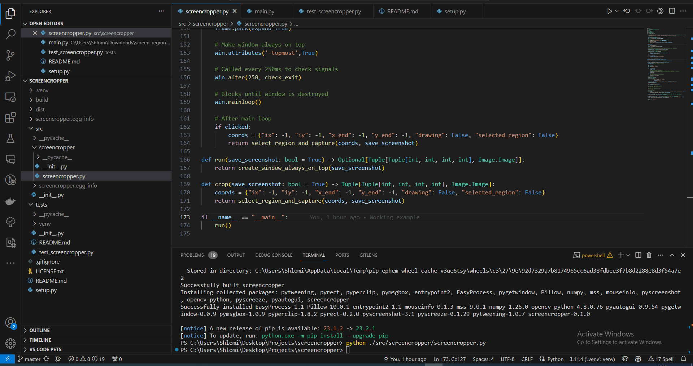

# screencropper

A Python library that allows to select a region of screen and either take screenshot as an application or use the coordinates in their program as library.



## Example usage

```python
from screencropper import crop, run

# Take screenshot of selected region and save it to file `screenshot.png`
region, image = crop()
print(region, image) # ((269, 34, 1259, 681), <PIL.Image.Image image mode=RGB size=1259x681 at 0x16401357790>)

# Don't save screenshot to file
region, image = crop(save_screenshot=False)
print(region, image) # ((74, 741, 115, 57), <PIL.Image.Image image mode=RGB size=115x57 at 0x22D2E6D7810>)

# Create window with button, when clicked, it crop the screen, save the image, and return region and the image
region, image = run()

# Create window with button, when clicked, it crop the screen and return the region and image
region, image = run(save_screenshot=False)
```
```

You can also just run from source as executable:

```bash
python ./src/screencropper/screencropper.py
```

## Build & install package locally

Build wheel: `python setup.py bdist_wheel`

Create source distribution: `python setup.py sdist`

And finally install locally: `pip install .`

### Another way

From the project root: `py -m build`

## Run tests

Run all tests: `python -m unittest discover`

Notice: you need to select a region of screen to pass the tests.
